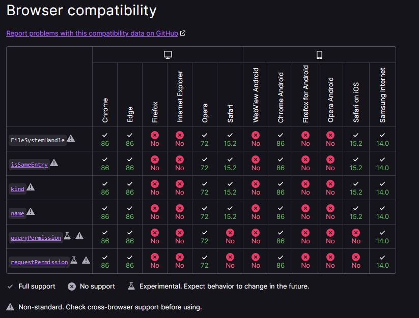
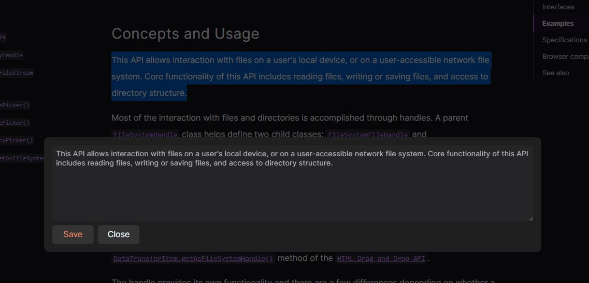
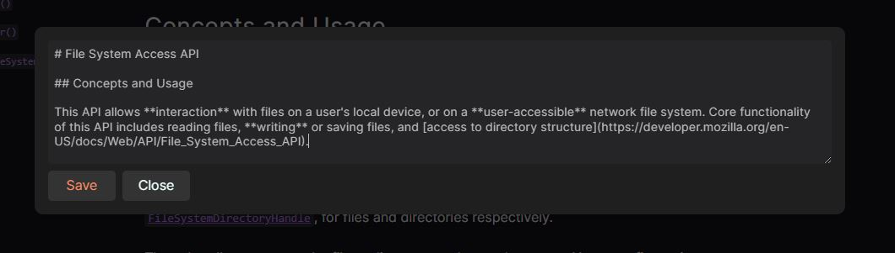
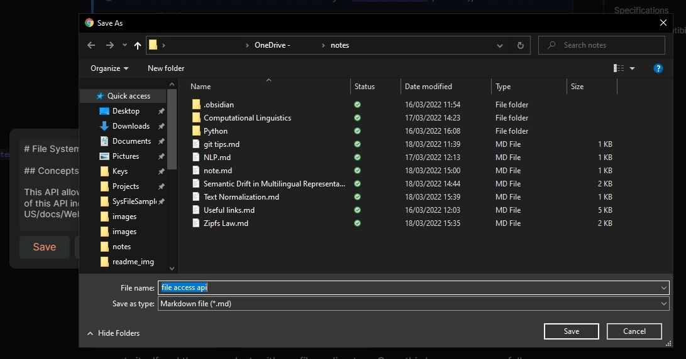
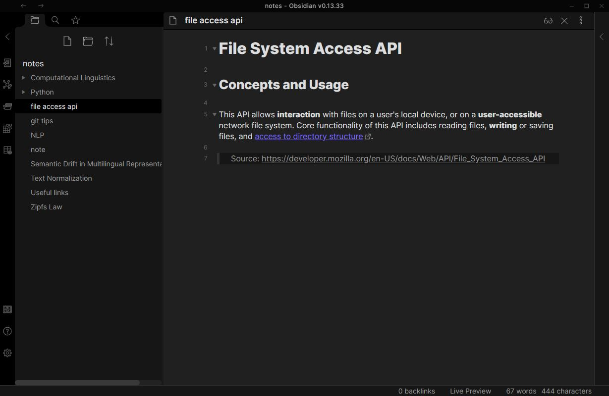

# MD-Note

**MD-Note** is a simple browser extension that allows users to save selected text from any page as a markdown or plain text file.

## Support

### Browser Support

This extension is using a [File System Access API](https://developer.mozilla.org/en-US/docs/Web/API/File_System_Access_API) to create and save files to a selected directory. This API is fairly recent and is not supported in all modern browsers. 

According to MDN it is supported in **Chrome**, **Edge**, **Opera** and **Safari** (*partially*).

### Saving Text From PDF

**MD-Note** has limited support for copying text from PDF files due to [BUG 1219825](https://bugs.chromium.org/p/chromium/issues/detail?id=1219825), which makes it work **only for files hosted online and viewed through default Chrome PDF plugin** (Example: [PDF Harry Potter Script](https://static1.squarespace.com/static/571a6e39b6aa608067028725/t/5d3c6cf0242c220001b7e648/1564241137104/1.01.pdf))

## Usage

1. Select text on any web page
2. Press `Alt + S` (The shortcut can be modified through [chrome://extensions/shortcuts/](chrome://extensions/shortcuts/))
3. Edit your note
   - MD-Note comes with a few handy shortcuts to add rich text capabilities
     - `Ctrl + B` : Adds `**` around selected text in the popup
     - `Ctrl + I` : Adds `*` around selected text in the popup 
     - `` Ctrl + ` `` : Adds `` ` `` around selected text in the popup
     - `Ctrl + [` : Converts selected text into a link `[selection](selection)`
4. Press `Save` to show a save file picker and select a directory with the new file name

 

